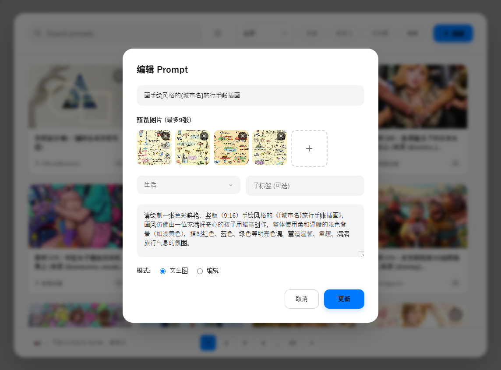

# 🍌 Banana Verse

**Banana Verse** is the ultimate prompt management extension for AI creators. Designed with a "Banana" philosophy (Simple on the outside, rich on the inside), it seamlessly integrates with Google AI Studio and Gemini to streamline your workflow.

## ✨ Features

*   **🚀 One-Click Injection**: Instantly insert complex prompts into AI Studio or Gemini input fields without copy-pasting.
*   **🎨 Visual Gallery**: Manage your prompts with beautiful cards, visual previews, and tags instead of boring text lists.
*   **📂 Organized Library**: Categorize prompts (Art, Code, Writing, etc.) for easy access.
*   **📝 Custom Prompt Editor**: Create, edit, and save your own prompts with image previews.
*   **❤️ Favorites**: Quickly access your most used prompts.
*   **🔌 Multi-Platform Support**:
    *   Google AI Studio
    *   Gemini (Consumer)
    *   Gemini (Business)
*   **⚡ Flash Mode**: Special high-efficiency prompts for quick inspiration.
*   **🔒 Privacy First**: All data is stored locally. Zero tracking.

## 📥 Installation

1.  Download or clone this repository.
2.  Open Chrome and go to `chrome://extensions/`.
3.  Enable **Developer mode** (top right).
4.  Click **Load unpacked**.
5.  Select the `extension` folder from this project.

## 🎮 How to Use

1.  **Open AI Studio or Gemini**: Navigate to `aistudio.google.com` or `gemini.google.com`.
2.  **Look for the Banana**: You will see a floating 🍌 button near the input area or chat controls.
3.  **Click to Open**: Click the button to open the Banana Verse modal.
4.  **Select a Prompt**: Browse the gallery and click on a card to insert the prompt directly into the chat.
5.  **Right-Click Magic**: You can also right-click in any text area and select "🍌 Insert Banana Prompts" to open the library.

## 🛡️ Privacy

Banana Verse is designed to be private and secure:
*   **Local Storage**: Your custom prompts and favorites are stored in your browser's local storage.
*   **No Server**: We do not have a backend server. We do not collect your personal data or prompts.
*   **Open Source**: The code is open for inspection.

For more details, please read our [Privacy Policy](privacy.html).

## 🤝 Contributing

Contributions are welcome! Please feel free to submit a Pull Request.

## 📄 License

This project is licensed under the MIT License.
